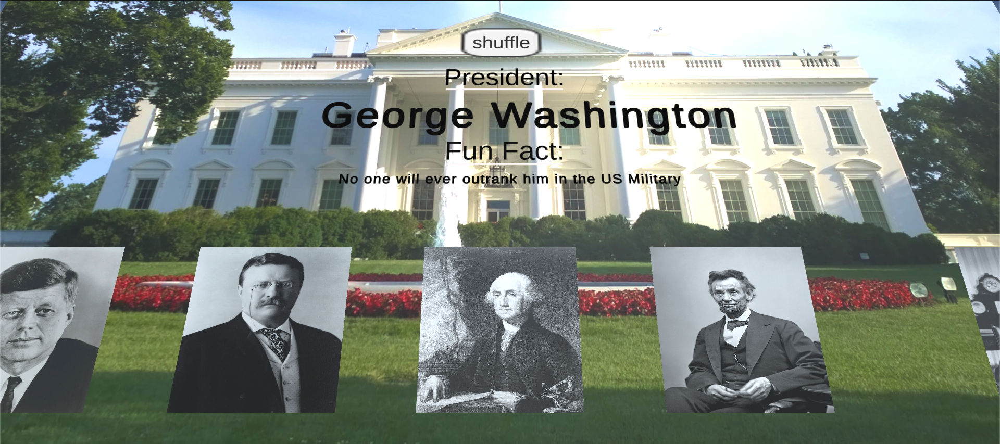

# Unity-PresidentsDay-echo3D-example
Learn about the 5 most popular presidents with this 3D shuffle trivia in Unity.

# Register
Don't have an API key? Make sure to register for FREE at [echo3D](https://console.echo3D.co/#/auth/register).

# Packages Used
* Unity 2020.3.26

# How to Play
Run the game and click shuffle and stop shuffle to view the different presidents and their fun facts.

# Setup

* Clone the [repo](https://github.com/ibbykhazanchi/echo3D-presidents-day-demo.git)
* Install the echo3D Unity SDK
* Download the 3D models in Models folder 
* Go to echo3D console and click "Add to Cloud" and upload the models
* Open the scene
* Set the API key in the echo3D.cs script inside the echo3D\echo3D.prefab using the the Inspector
* Build and run the AR application

# Troubleshooting
See known issues here: https://docs.echo3d.co/unity/troubleshooting

# Learn More
Refer to our [documentation](https://docs.echo3D.co/unity/) to learn more about how to use Unity and echo3D.
# Support
Feel free to reach out at [support@echo3D.co](mailto:support@echo3D.co) or join our [support channel on Slack](https://go.echo3D.co/join).

## Screenshots

